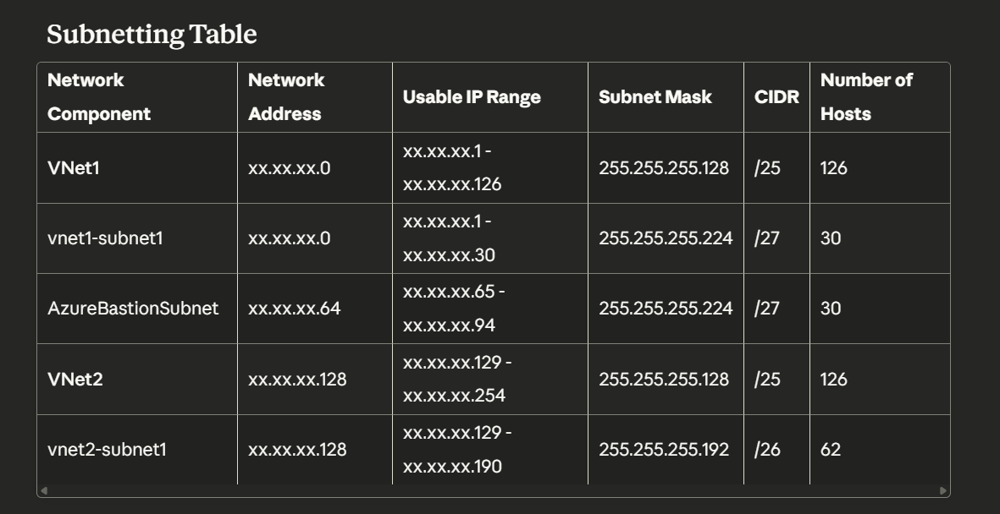
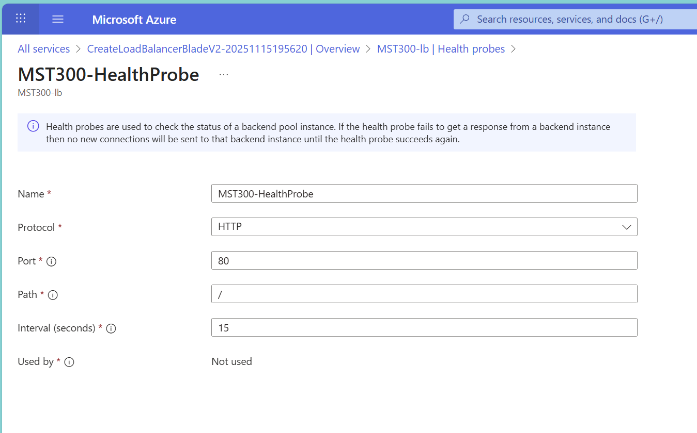
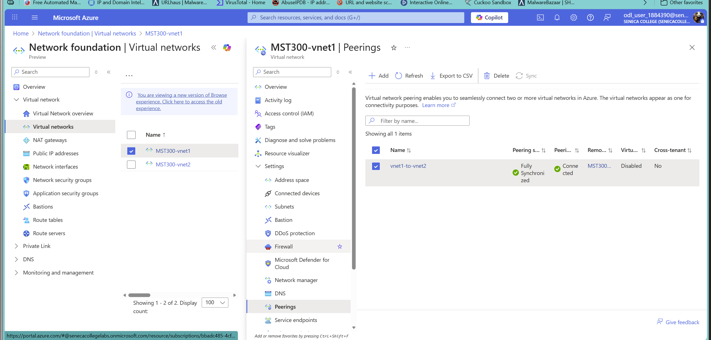
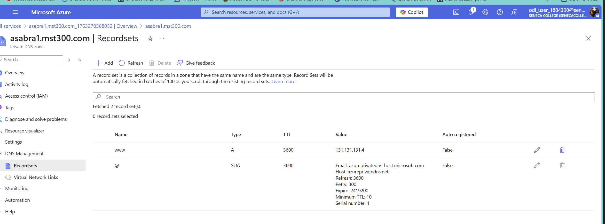
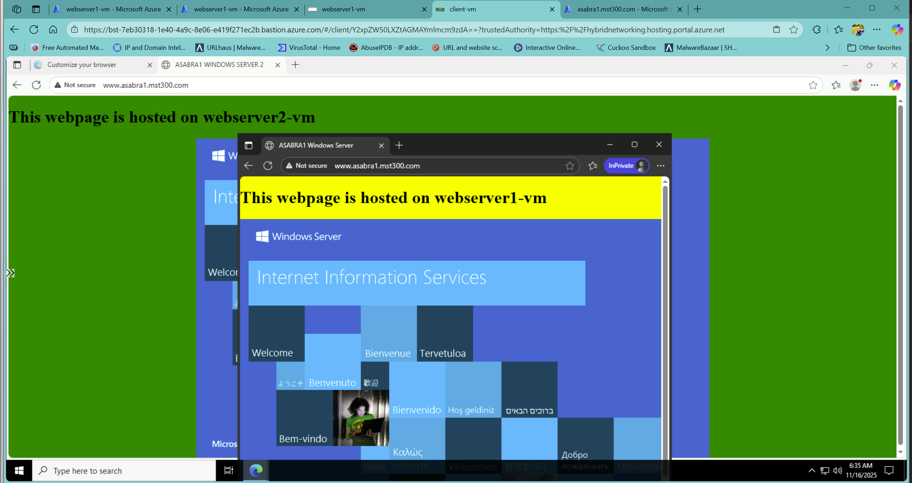

# MST300-Project2-Load-Balancing
Azure load balancing project built for Seneca’s MST300 course. Includes an internal load balancer, two IIS web servers across availability zones, a client VM on a separate VNet, private DNS integration, and full VNet peering configuration. Demonstrates high-availability web hosting and traffic distribution in Azure.
# MST300 Project 2: Load Balancing Websites

## Project Overview

This project demonstrates how to create an internal load balancer in Azure that distributes traffic between two IIS web servers. A client VM in a separate virtual network accesses the load-balanced website through Azure Virtual Network peering and Private DNS.

## Architecture Components

- **2 Virtual Networks** (with VNet peering)
- **2 Web Servers** (Windows Server 2019 with IIS)
- **1 Internal Load Balancer**
- **1 Client VM** (Windows 10)
- **1 Azure Bastion Host**
- **1 Private DNS Zone**

---

## Prerequisites

- Azure for Students subscription
- Assigned network address space (e.g., 131.131.131.0/24)
- Basic understanding of Azure networking

---

## Network Subnetting Plan

| Network Component | Network Address | Usable IP Range | Subnet Mask | CIDR | Number of Hosts |
|------------------|-----------------|-----------------|-------------|------|-----------------|
| **VNet1** | xx.xx.xx.0 | xx.xx.xx.1 - xx.xx.xx.127 | 255.255.255.128 | /25 | 126 |
| vnet1-subnet1 | xx.xx.xx.0 | xx.xx.xx.1 - xx.xx.xx.30 | 255.255.255.224 | /27 | 30 |
| AzureBastionSubnet | xx.xx.xx.64 | xx.xx.xx.65 - xx.xx.xx.94 | 255.255.255.224 | /27 | 30 |
| **VNet2** | xx.xx.xx.128 | xx.xx.xx.129 - xx.xx.xx.254 | 255.255.255.128 | /25 | 126 |
| vnet2-subnet1 | xx.xx.xx.128 | xx.xx.xx.129 - xx.xx.xx.190 | 255.255.255.192 | /26 | 62 |

**Important:** VNet1 and VNet2 must NOT have overlapping address spaces. Use the first /25 for VNet1 (0-127) and second /25 for VNet2 (128-255).



---

## Step-by-Step Implementation

### Step 1: Create Resource Group

1. Navigate to **Resource groups** in Azure Portal
2. Click **+ Create**
3. Configure:
   - **Resource group name:** `MST300-project2-rg`
   - **Region:** East US
4. Click **Review + create** → **Create**

---

### Step 2: Create Virtual Networks

#### VNet1 (for web servers and Bastion)

1. Search for **Virtual networks** → **+ Create**
2. **Basics:**
   - **Resource group:** MST300-project2-rg
   - **Name:** MST300-vnet1
   - **Region:** East US
3. **IP Addresses:**
   - **Address space:** xx.xx.xx.0/25
   - **Add subnet:**
     - **Name:** vnet1-subnet1
     - **Address range:** xx.xx.xx.0/27
   - **Add subnet:**
     - **Name:** AzureBastionSubnet *(must be this exact name)*
     - **Address range:** xx.xx.xx.64/27
4. **Review + create** → **Create**

#### VNet2 (for client VM)

1. Repeat the process with:
   - **Name:** MST300-vnet2
   - **Address space:** xx.xx.xx.128/25
   - **Subnet name:** vnet2-subnet1
   - **Subnet range:** xx.xx.xx.128/26

---

### Step 3: Create Internal Load Balancer

1. Search for **Load balancers** → **+ Create**
2. **Basics:**
   - **Resource group:** MST300-project2-rg
   - **Name:** MST300-lb
   - **Region:** East US
   - **SKU:** Standard
   - **Type:** Internal
   - **Tier:** Regional
3. **Frontend IP Configuration:**
   - **Name:** LoadBalancerFrontEnd
   - **Virtual network:** MST300-vnet1
   - **Subnet:** vnet1-subnet1
   - **Assignment:** Dynamic
4. **Review + create** → **Create**

#### Configure Backend Pool

1. Go to **MST300-lb** → **Backend pools** → **+ Add**
2. **Name:** MST300-BackendPool
3. **Virtual network:** MST300-vnet1
4. Click **Save** (VMs will be added later)

#### Configure Health Probe

1. Go to **Health probes** → **+ Add**
2. Configure:
   - **Name:** MST300-HealthProbe
   - **Protocol:** HTTP
   - **Port:** 80
   - **Interval:** 15
   - **Unhealthy threshold:** 3
3. Click **Save**



#### Configure Load Balancing Rule

1. Go to **Load balancing rules** → **+ Add**
2. Configure:
   - **Name:** MST300-HTTPRule
   - **IP Version:** IPv4
   - **Protocol:** TCP
   - **Port:** 80
   - **Backend port:** 80
   - **Backend pool:** MST300-BackendPool
   - **Health probe:** MST300-HealthProbe
   - **Session persistence:** None
   - **Idle timeout:** 15
   - **TCP reset:** Enabled
3. Click **Save**

---

### Step 4: Deploy Azure Bastion

⚠️ **Note:** Bastion takes 10-15 minutes to deploy. Start this early!

1. Search for **Bastions** → **+ Create**
2. Configure:
   - **Resource group:** MST300-project2-rg
   - **Name:** MST300-BastionHost
   - **Region:** East US
   - **Tier:** Basic
   - **Virtual network:** MST300-vnet1
   - **Subnet:** AzureBastionSubnet
   - **Public IP name:** MST300-BastionIP
3. **Review + create** → **Create**

---

### Step 5: Create Web Server VMs

⚠️ **CRITICAL:** Seneca's Azure policy requires **Standard HDD (Standard_LRS)** disk type. Premium SSD will fail deployment!

#### Webserver 1

1. Search for **Virtual machines** → **+ Create**
2. **Basics:**
   - **Resource group:** MST300-project2-rg
   - **VM name:** webserver1-vm
   - **Region:** East US
   - **Availability zone:** Zone 1
   - **Image:** Windows Server 2019 Datacenter - Gen1
   - **Size:** Standard_B2s *(minimum for IIS performance)*
   - **Username:** azureuser
   - **Password:** *(create strong password)*
   - **Public inbound ports:** None
3. **Disks:**
   - **OS disk type:** Standard HDD (Standard_LRS)
4. **Networking:**
   - **Virtual network:** MST300-vnet1
   - **Subnet:** vnet1-subnet1
   - **Public IP:** None
   - **Load balancing:** Azure load balancer
   - **Select load balancer:** MST300-lb
   - **Backend pool:** MST300-BackendPool
5. **Review + create** → **Create**

#### Webserver 2

Repeat the same steps with:
- **VM name:** webserver2-vm
- **Availability zone:** Zone 2
- Everything else identical

---

### Step 6: Install and Configure IIS

#### Install IIS on Both Servers

1. Connect to each webserver via **Azure Bastion**
2. Open **Server Manager** → **Add roles and features**
3. Select **Web Server (IIS)**
4. Complete installation

#### Customize Webserver 1

1. Navigate to: `C:\inetpub\wwwroot`
2. Right-click **iisstart.htm** → Open with **Notepad**
3. Edit the HTML:
```html
   <!DOCTYPE html>
   <html>
   <head>
       <title>yourStudentID's Windows Server</title>
   </head>
   <body style="background-color: yellow;">
       <h1>This webpage is hosted on webserver1-vm</h1>
       <!-- Keep the rest of the IIS content -->
   </body>
   </html>
```
4. Save the file
5. Test locally: Open browser → `http://localhost`

#### Customize Webserver 2

Repeat with:
- **Title:** `yourStudentID's WebPage`
- **Background color:** green
- **Text:** "This webpage is hosted on webserver2-vm"

---

### Step 7: Create Client VM

1. Search for **Virtual machines** → **+ Create**
2. **Basics:**
   - **Resource group:** MST300-project2-rg
   - **VM name:** client-vm
   - **Region:** East US
   - **Image:** Windows 10 Pro, Version 20H2 - Gen1
   - **Size:** Standard_B1s
   - **Public inbound ports:** None
3. **Disks:**
   - **OS disk type:** Standard HDD (Standard_LRS)
4. **Networking:**
   - **Virtual network:** MST300-vnet2
   - **Subnet:** vnet2-subnet1
   - **Public IP:** None
5. **Review + create** → **Create**

---

### Step 8: Configure Virtual Network Peering

1. Go to **MST300-vnet1** → **Peerings** → **+ Add**
2. Configure:
   - **This virtual network - Peering link name:** vnet1-to-vnet2
   - **Remote virtual network - Peering link name:** vnet2-to-vnet1
   - **Virtual network:** MST300-vnet2
   - **Allow traffic to/from remote:** Enabled
   - **Allow gateway transit:** Disabled
3. Click **Add**
4. Wait for status to show **Connected**



---

### Step 9: Create Private DNS Zone

1. Search for **Private DNS zones** → **+ Create**
2. Configure:
   - **Resource group:** MST300-project2-rg
   - **Name:** `yourStudentID.mst300.com`
3. **Review + create** → **Create**

#### Link DNS to VNet2

1. Go to your DNS zone → **Virtual network links** → **+ Add**
2. Configure:
   - **Link name:** vnet2-link
   - **Virtual network:** MST300-vnet2
   - **Enable auto registration:** ✓ Checked
3. Click **OK**

#### Create A Record for Load Balancer

1. Go to **Record sets** → **+ Record set**
2. Configure:
   - **Name:** www
   - **Type:** A
   - **TTL:** 1 Hour
   - **IP address:** *(Load balancer frontend IP - find in MST300-lb → Overview)*
3. Click **OK**



---

## Testing & Verification

### Test Load Balancing

1. Connect to **client-vm** via Azure Bastion
2. Open browser
3. Navigate to: `http://www.yourStudentID.mst300.com`
4. **Refresh the page multiple times (F5)**
5. You should see the page alternate between:
   - **Yellow background** = webserver1-vm
   - **Green background** = webserver2-vm



This proves:
- ✅ Load balancer is distributing traffic
- ✅ Both web servers are healthy
- ✅ VNet peering is working
- ✅ Private DNS is resolving correctly
- ✅ Health probes are functioning

---

## Troubleshooting Guide

### Issue 1: VM Deployment Fails with Disk Policy Error

**Error:** `RequestDisallowedByPolicy` - Premium SSD not allowed

**Solution:** 
- Use **Standard HDD (Standard_LRS)** as OS disk type
- Seneca's Azure policy blocks Premium SSD disks

---

### Issue 2: IIS Installation Fails or VM is Slow

**Problem:** Standard_B1s (1 vCPU, 1 GB RAM) insufficient for Windows Server 2019 + IIS

**Solution:**
- Resize VM to **Standard_B2s** (2 vCPUs, 4 GB RAM) minimum
- Stop VM → Go to **Size** → Select Standard_B2s → Resize

---

### Issue 3: VNet Peering Fails - Address Space Overlap

**Error:** "Address space overlaps"

**Solution:**
- VNet1 and VNet2 must use non-overlapping ranges
- If you only have /24 assigned:
  - VNet1: xx.xx.xx.0/25 (0-127)
  - VNet2: xx.xx.xx.128/25 (128-255)
- Alternatively, use completely different private ranges (e.g., VNet2: 10.0.0.0/24)

---

### Issue 4: Azure Capacity Issues - Cannot Start VM

**Error:** `ZonalAllocationFailed` - No capacity in availability zone

**Solutions:**
1. Try starting the VM multiple times (sometimes works on retry)
2. If VM needs to be recreated:
   - Stop and delete the VM (keep the disk!)
   - Create new VM from existing disk
   - Re-add VM to load balancer backend pool
3. Try different VM sizes (D-series often has better availability)

---

### Issue 5: Load Balancer Shows Only One Server

**Problem:** After recreating a VM, it's not in the backend pool

**Solution:**
- Go to **MST300-lb** → **Backend pools** → **MST300-BackendPool**
- Click **+ Add**
- Select the missing VM's NIC
- Click **Save**

---

### Issue 6: Website Not Accessible from Client VM

**Checklist:**
1. VNet peering status = **Connected** ✓
2. DNS A record points to correct load balancer IP ✓
3. DNS zone linked to vnet2 with auto-registration enabled ✓
4. Both webservers running and in backend pool ✓
5. Health probes showing healthy ✓

---

## Important Notes

### Cost Management

⚠️ **Azure Bastion cannot be stopped and incurs continuous charges!**

**To minimize costs:**
1. Delete all resources after completing the project
2. Record your video demonstration first
3. Take screenshots for documentation
4. Delete the entire resource group: `MST300-project2-rg`

### Best Practices

- Always use **Standard_LRS** (Standard HDD) for Seneca deployments
- Use **Standard_B2s** minimum for Windows Server VMs with IIS
- Plan IP addressing carefully to avoid overlaps
- Test locally on each webserver before load balancer testing
- Document your configuration for future reference

---

## Project Rubric Components

Your video demonstration should show:

1. ✅ **Azure Bastion** - Connecting to client-vm via Bastion
2. ✅ **Load Balancer** - Configuration + browser switching between servers
3. ✅ **Webservers** - Both VMs with customized IIS pages (different colors)
4. ✅ **VNet Peering** - Connected status between vnet1 and vnet2
5. ✅ **Private DNS** - Accessing website via FQDN

---

## Additional Resources

- [Azure Bastion Documentation](https://docs.microsoft.com/azure/bastion/)
- [Azure Load Balancer Tutorial](https://docs.microsoft.com/azure/load-balancer/)
- [Azure Virtual Network Peering](https://docs.microsoft.com/azure/virtual-network/virtual-network-peering-overview)
- [Azure Private DNS Zones](https://docs.microsoft.com/azure/dns/private-dns-overview)

---

## 🔎 Project Keywords (SEO & Discoverability)

This project is related to the following topics and keywords:

**Seneca College**, **Seneca Polytechnic**, **MST300**, **MST300 Project 2**,  
**Load Balancing**, **Azure Load Balancer**, **Internal Load Balancer**,  
**Azure Networking**, **VNet Peering**, **Private DNS**,  
**Azure for Students**, **CSN Program**, **Networking Projects**,  
**Seneca Networking Assignment**, **Windows Server IIS**, **Traffic Distribution**

These keywords help students, instructors, and recruiters discover this project more easily through GitHub and search engines.

---

## 📘 Additional Notes

This project was completed as part of the *Seneca – Computer Systems Networking (CSN)* program and serves as a hands-on demonstration of Azure networking, load balancing, virtual machines, and high-availability web hosting.

Future students searching for **“MST300 Project 2 Load Balancing”** should find this repository helpful as a reference for architecture, configuration, verification, and troubleshooting.

---

## Author

Ahmed Sabra - MST300 Project 2 - Fall 2025

---

## License

This project guide is for educational purposes as part of Seneca College's MST300 course.
